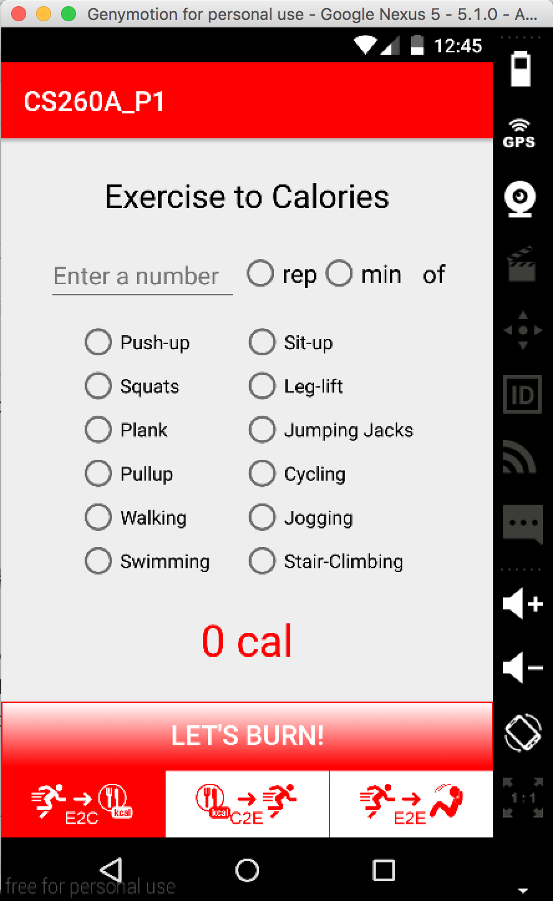

# PROG 01: Crunch Time

This App is the first assignment of CS260A. It implements three functions: to convert calories to exercise, to convert exercise to calories, and to convert between two different exercises. 

## Authors

Yanrong Li ([yanrong.li@berkeley.edu](mailto:yanrong.li@berkeley.edu))

## Demo Video

See [your demo video title here] (https://youtu.be/gkHN6JgyHXU)

## Screenshots

## Acknowledgments

* For RadioGridGroup, I adopted Nigam Patro's answer from StackOverFlow (http://stackoverflow.com/questions/2381560/how-to-group-a-3x3-grid-of-radio-buttons)

*Feel free to enhance your README. For Markdown syntax, see [the GitHub Guides](https://guides.github.com/features/mastering-markdown/). Remove this line in your submission.*
